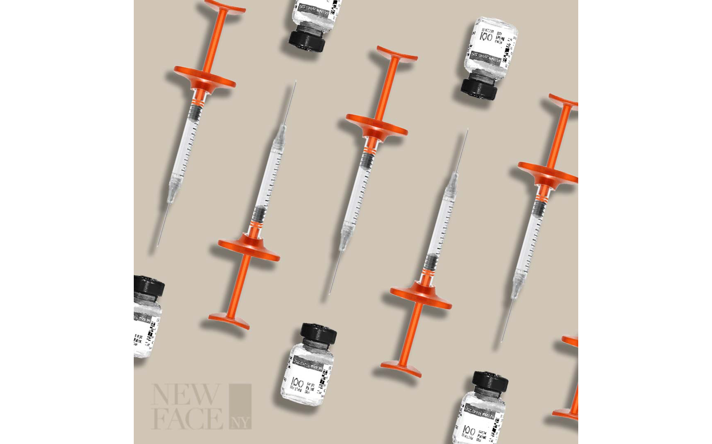

Levaraged basic design principles with Photoshop CC to market a Halloween special for cosmetic injectables. Repetition of key elements (recolored objects, oientation, spacing) achieve unity. This consistency provides a sense of comfort to audiences, which maximizes visual impact.

